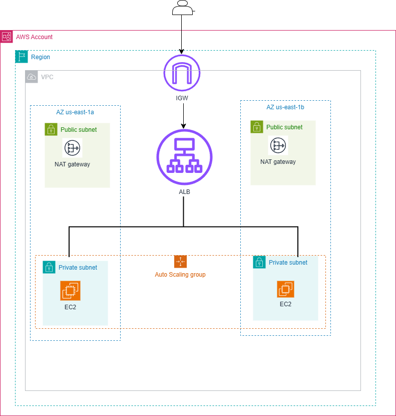

# GitLab CI/CD Pipeline for Deploying Spring Boot Application to EC2 using Terraform

## Author:

 - Sagar Borse

## Overview
In this project, I have built a production-ready AWS infrastructure using Terraform that is highly available, secure, automated, and scalable.
  

## Prerequisites

## Architecture Overview
  
- **Terraform:** Used to provision AWS infrastructure.

- **VPC**: Contains public and private subnets.

- **Public Subnets:** NAT Gateway.

- **Private Subnets:** EC2 instances.

- **Load Balancer:** ALB to distribute traffic.

- **Auto Scaling:** 

## Setup Instructions.

- Clone the repository:
  - https://gitlab.com/java-app2964423/spring-boot-app.git
  - cd spring-boot-app

- Configure AWS credentials in GitLab CI/CD variables:

  - **AWS_ACCESS_KEY_ID**
  - **AWS_SECRET_ACCESS_KEY**

- **Add SSH Key to GitLab CI/CD variables:**

  - SSH_PRIVATE_KEY: Private key for accessing EC2 instance.

## GitLab CI/CD Configuration

- **.gitlab-ci.yml**

## Terraform Configuration

- main.tf:
- provider.tf
- output.tf

## Deployment Steps

- Push code to GitLab.

- GitLab Runner triggers the pipeline.

- Application is built and deployed to EC2.

## Troubleshooting

- Ensure the EC2 instance is accessible via SSH.
- Check GitLab CI/CD logs for errors.
- Validate Terraform configuration with terraform plan.